# Msingi-SaaS

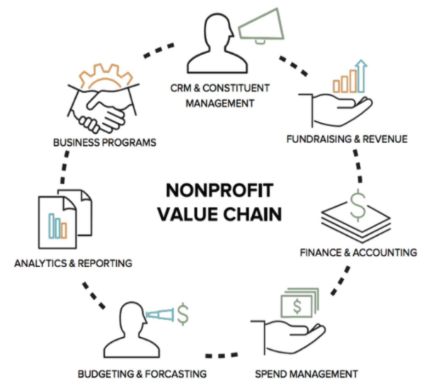

Improve requisition process efficiency
Cut on paper work and digitize organization requisitions and payment records.
Enable mobile and virtual signing and processing of documents.
Ensure requisition processes and documents are secure.

#  Tech Stack
Using Microfrontend & Microservices architecture. 
 - Frontend: React
 - Backend: Ruby on Rails
 - Database:  postgresql
 - GitHub: Version Control Manager

 # Features
 
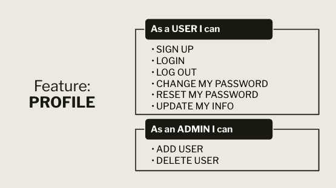

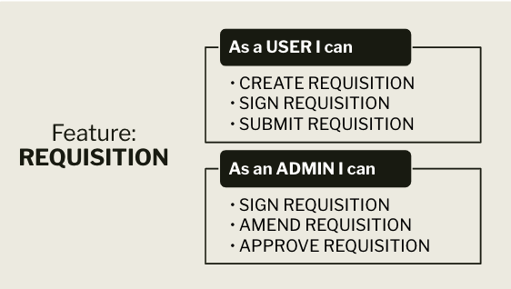

# Future Features

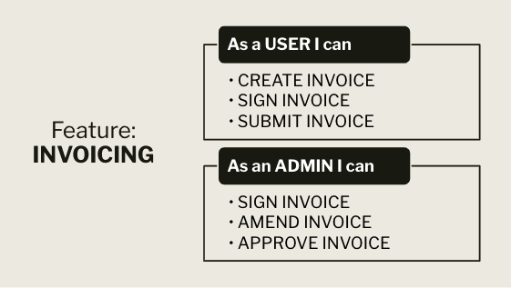

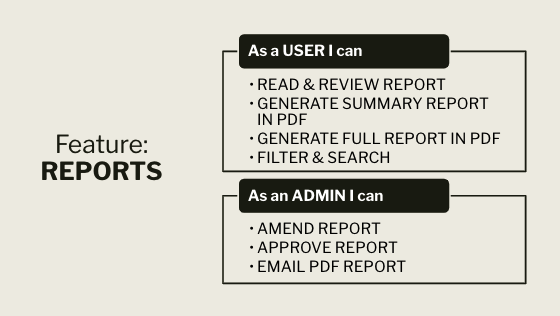

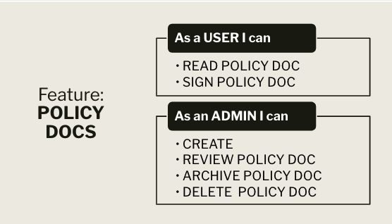

# UI Design
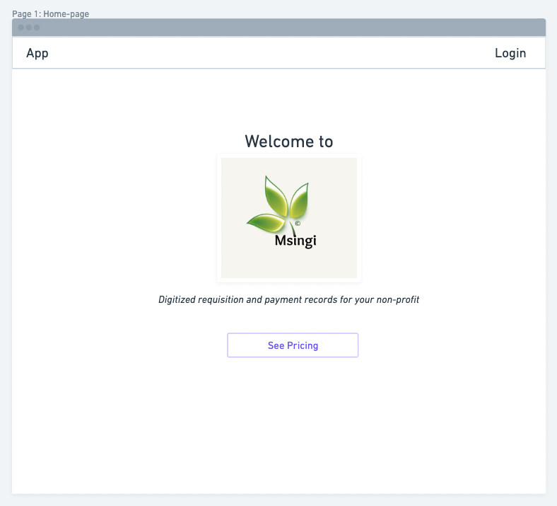
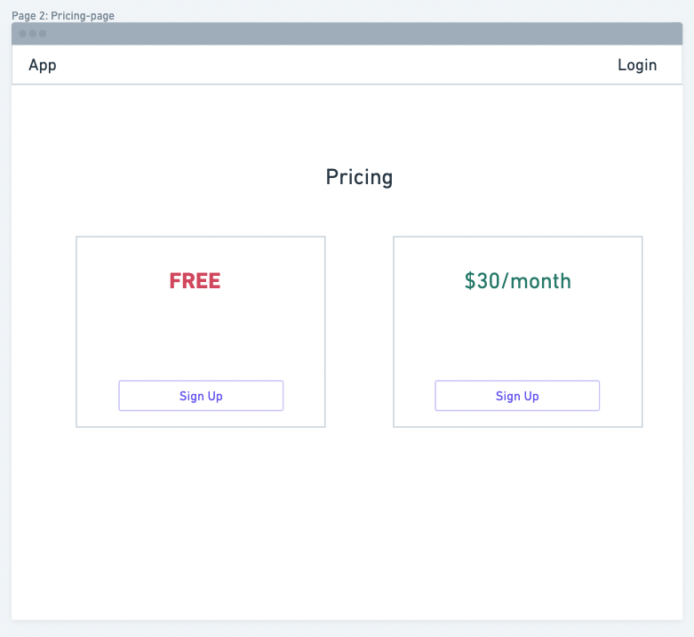
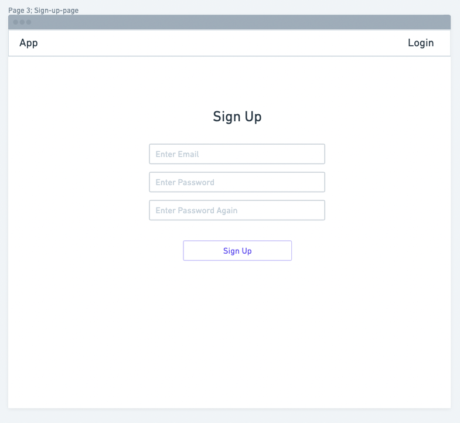
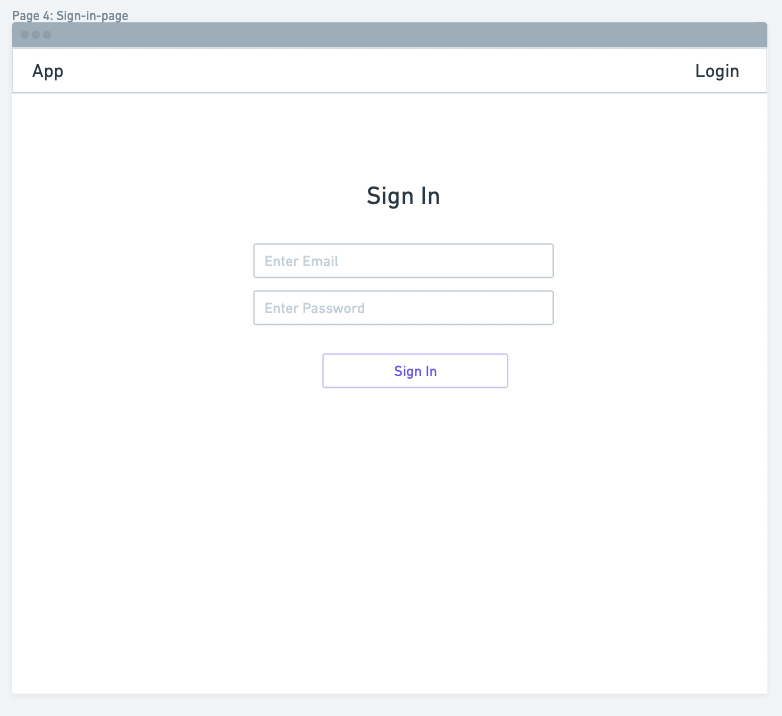
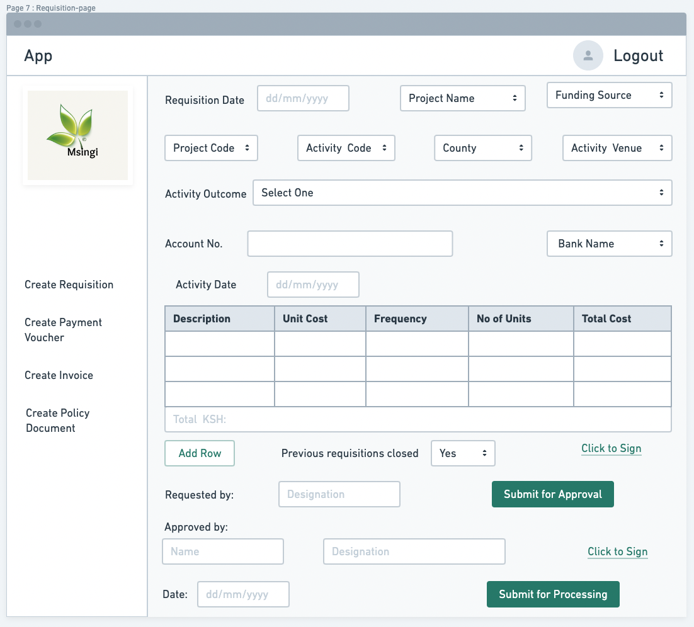
